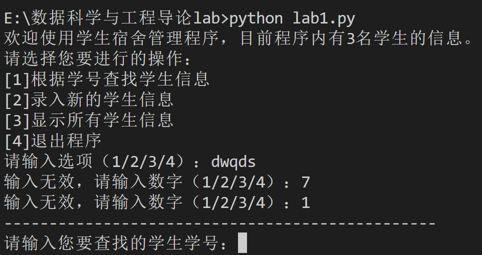
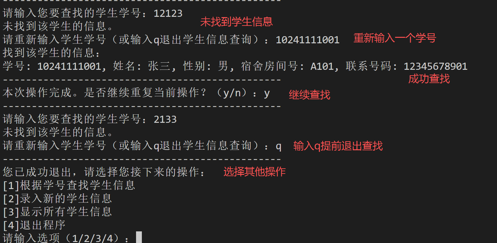
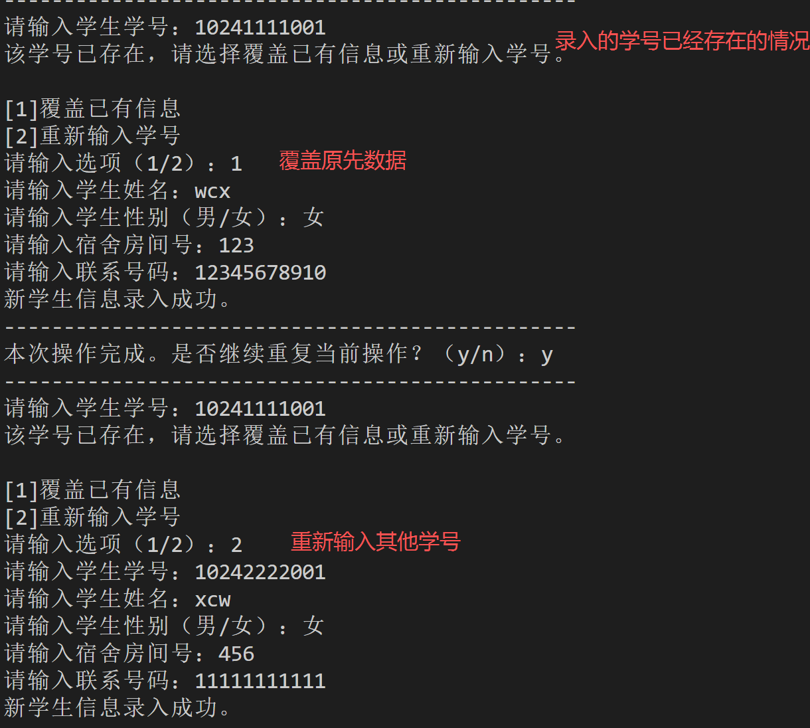
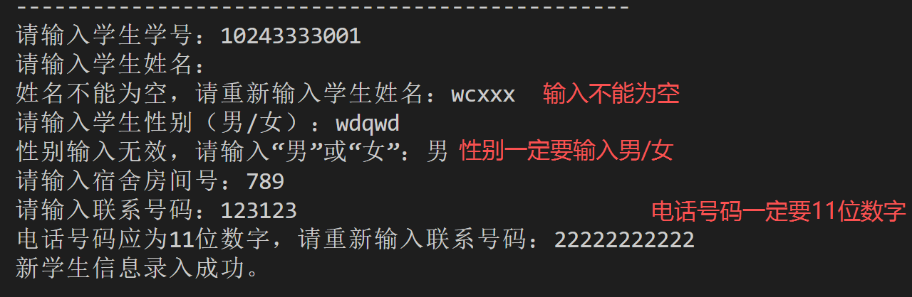
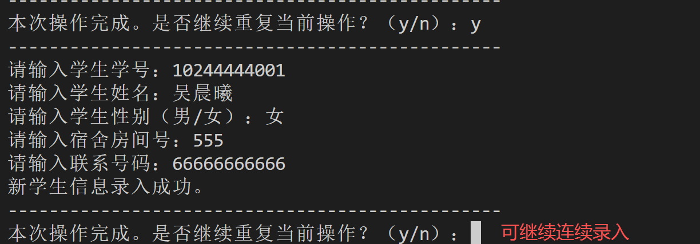
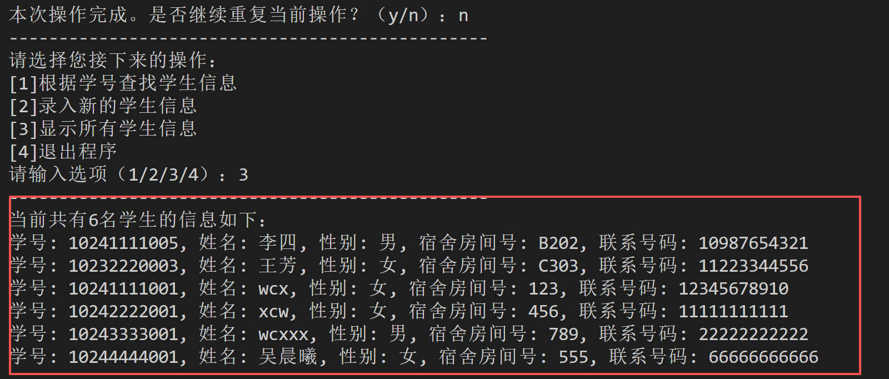
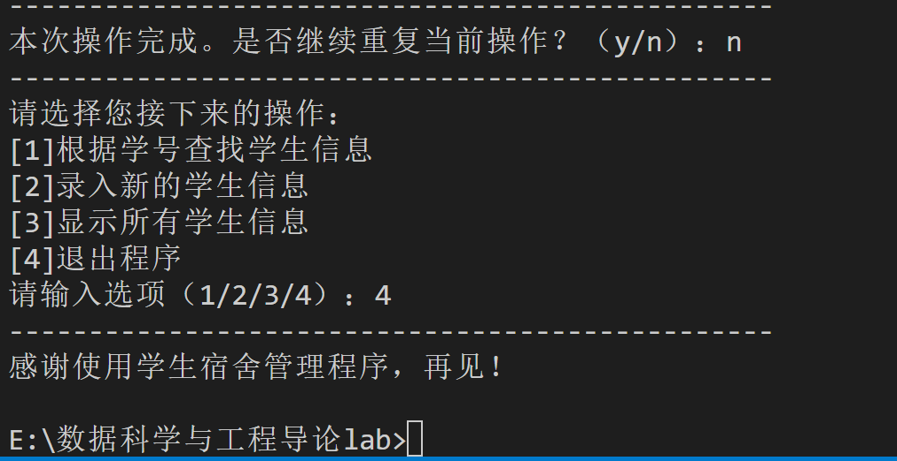

# lab1 学生宿舍管理程序

## 1程序思路

首先，为了存储每个学生的学号、姓名、性别、宿舍号、联系电话信息，本程序**定义了一个`Student`类**来，并定义了该类下的`display_info`方法来方便地展示学生的信息，然后为了**便于查找**，本程序使用**字典**存储所有`Student`对象，以学号`student_id`作为键，对应的`Student`对象作为值。在**主程序流程**中，首先向用户展示功能菜单供其选择，并进行**输入检查**，然后执行用户选择的对应功能，执行完后，询问用户**是否继续执行该功能**，若是，则重复执行；若不是，则重新选择要执行的功能或者退出程序。

## 2核心代码解释

#### 2.1 核心数据结构：`Student`类与字典存储

```python
class Student:
    def __init__(self, student_id, name, gender, room_number, phone_number):
        self.student_id = student_id
        self.name = name
        self.gender = gender
        self.room_number = room_number
        self.phone_number = phone_number

    def display_info(self):
        print(f"学号: {self.student_id}, 姓名: {self.name}, 性别: {self.gender}, 宿舍房间号: {self.room_number}, 联系号码: {self.phone_number}")
```

为了便于管理学生的各项**结构化信息**，本程序将学生实体抽象成一个**类**，将每个属性（学号、姓名等）作为实例变量，并`display_info`方法封装了打印自身信息的行为，**方便向系统中加入新的学生实例以及展示学生信息**。

```python
students = {
    "10241111001": Student("10241111001", "张三", "男", "A101", "12345678901"),
    ...
}
```

利用**字典存储所有学生对象**，由于学号的唯一性，使用字典能够提高**学号查询的效率**（时间复杂度接近O(1)）。

#### 2.2 菜单选择与输入检查

本程序提供了一个功能选择菜单，后续程序通过`choice`的值和`if-else`结构来执行对应的功能：

```python
choice = input("请选择您要进行的操作：\n[1]根据学号查找学生信息\n[2]录入新的学生信息\n[3]显示所有学生信息\n[4]退出程序\n请输入选项（1/2/3/4）：")

while choice != '4': # 若用户选择退出程序则不进入循环
    输入检查
    ...
    if choice == '1':
        功能一实现
        ...
    elif choice == '2':
        功能二实现
        ...
    elif choice == '3':
        功能三实现
        ...
```

同时使用 `try-except` 和 `while` 循环**确保用户输入必须是1, 2, 3, 4中的一个数字**，增加了程序的鲁棒性。

```python
# 输入检查
while choice != '4':
        # 输入验证
        loop = True
        while loop: # while循环的目的是一直检验直到用户输入合法为止
            try:
                choice = int(choice) # 检验用户输入是否为整数
                if choice in [1, 2, 3, 4]: # 检验用户输入是否为1-4的整数
                    loop = False
                else:
                    choice = input("输入无效，请输入数字（1/2/3/4）：")
            except ValueError:
                choice = input("输入无效，请输入数字（1/2/3/4）：")
```

#### 2.3 功能1：查找学生信息

对于此功能，程序**能够应对所查找学号不存在的情况**，并提示用户重新输入学号。同时，为了**避免程序陷入一直”未找到该学生信息“的循环**，用户可以通过输入`q`来直接结束查询，程序通过变量`q_early`来标记用户是否选择直接结束。

通过**字典中的`get`方法**来查找对应学号的学生信息，同时，由于`get`方法在查找不存在的键时能够默认返回`None`，也可以同时判断是否找到该学生，使程序**简洁且鲁棒**。

```python
# 1查找学生信息
        q_early = False # 标记是否提前退出查询的变量
        if choice == 1:
            print('------------------------------------------------')
            student_id = input("请输入您要查找的学生学号：")
            found = False
            while not found:
                student_info = students.get(student_id)  # 通过字典的get获取学生信息同时判断是否找到
                if student_info:
                    print("找到该学生的信息：")
                    student_info.display_info()
                    found = True
                if not found:
                    print("未找到该学生的信息。")
                    student_id = input("请重新输入学生学号（或输入q退出学生信息查询）：")
                    if student_id == 'q':
                        q_early = True # 标记提前退出查询
                        break
```

#### 2.4 功能2：录入新的学生信息

执行此功能时，主要对用户的录入的信息进行检查，首先，**每个信息的输入皆不能为空**，用一个`while`循环进行判断

```python
while not student_id:
    student_id = input("学号不能为空，请重新输入学生学号：")
```

然后对于**学号**，需要保证系统中**相同的学号最多只能有一条记录**，同样使用字典的`get`方法来查找如果录入的学号在系统中已有记录，需要选择是覆盖原有记录（用`del`直接删掉原有键值对），还是重新输入其他学号

```python
# 保证系统内一个学号对应一个学生
number_unique = False
    while not number_unique:
        student_info = students.get(student_id)
        if student_info!=None:# 学号有重复
            number_unique = False
            print("该学号已存在，请选择覆盖已有信息或重新输入学号。\n")
            choice2 = input("[1]覆盖已有信息\n[2]重新输入学号\n请输入选项（1/2）：")
            if choice2 == '1':
                del students[student_id] # 删除原有键值对
                number_unique = True
            elif choice2 == '2':
                student_id = input("请输入学生学号：") # 重新输入其他学号
                while not student_id:
                    student_id = input("学号不能为空，请重新输入学生学号：")
            else:
                print("输入无效，请重新选择。")
        else: # 学号不重复
            number_unique = True
```

对于性别，需要**保证输入的是“男/女”**，否则提示用户重新输入

```python
 while gender not in ["男", "女"]:
    gender = input("性别输入无效，请输入“男”或“女”：")
```

对于联系电话，**必须是11位的数字**，否则提示用户重新输入

```python
while len(phone_number) != 11 or not phone_number.isdigit():
    phone_number = input("电话号码应为11位数字，请重新输入联系号码：")
```

#### 2.5 功能3：显示所有学生信息

本程序通过`for`循环遍历`students.values()`(存储学生信息的字典中的值)，并调用封装在`Student`类中的`display_info`方法来显示所有学生的信息。

```python
print(f"当前共有{len(students)}名学生的信息如下：")
for student in students.values():
    student.display_info()
```

#### 2.6 重复运行与重新选择

为了**增加程序使用的高效性并增加用户体验**，每次执行完当前功能后，会询问用户是否继续重复当前操作（是否继续的选择赋入`conti`变量），若用户选择`n`，则像开头一样再次给用户提供选择功能的菜单；若用户选择`y`，则当前`choice`不变，重复执行该功能；若用户输入的既不是`y`也不是`n`，则提示用户重新按要求输入

```python
conti = input("本次操作完成。是否继续重复当前操作？（y/n）：")
is_y_n = False
while not is_y_n:
    if conti.lower() == 'n':
        is_y_n = True
        print('------------------------------------------------')
        # 再次出现菜单供用户选择
        choice = input(f'请选择您接下来的操作：\n[1]根据学号查找学生信息\n[2]录入新的学生信息\n[3]显示所有学生信息\n[4]退出程序\n请输入选项（1/2/3/4）：')
    elif conti.lower() == 'y':
        is_y_n = True
        choice = str(choice) # choice仍然和上一轮一样
    else:
        conti = input("输入无效。请重新选择是否继续当前操作？（y/n）：")
```

# 3运行示例

#### 3.1 功能选择

必须输入1/2/3/4，若是输入非数字或不是1-4均不行



#### 3.2 根据学号查找信息



#### 3.3 录入学生信息





正常情况：



#### 3.4 展示所有信息



#### 3.5 退出程序




