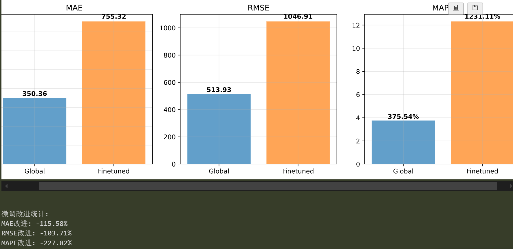
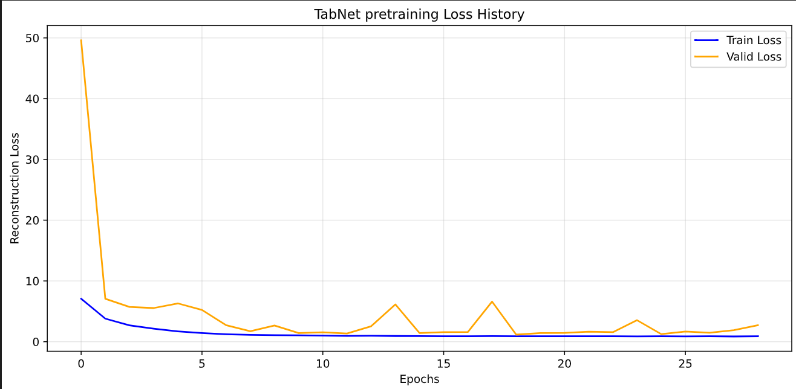
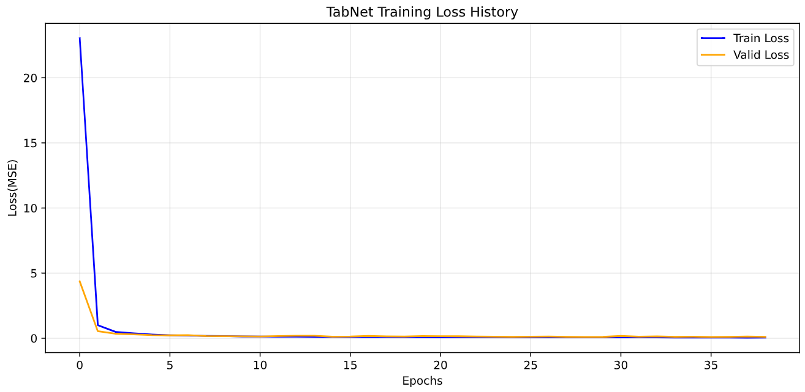
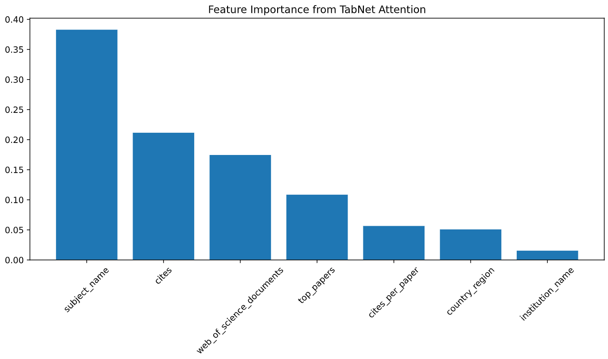

# lab7 表格深度学习改进

本次实验主要在上次的esi学科数据**深度学习排名预测模型**的基础上对模型进行改进，使用了更适合表格数据的模型，对应的代码在`tabnet.ipynb`。

## 0 实验数据准备

和之前几次实验一样，在lab4通过sql语句得到的`unified_data`的基础上，在mysql workbench中把`unified_data`导出为`alldata.csv`，作为本次实验分析的**数据来源**。

- 查看**数据基本信息**

  原数据形状：（34121，9）

- 清除**数据缺失值**

  通过`df.isnull().sum()`来查找原数据是否有缺失值，结果显示除了在`country_region`上有3161个确实值以外别的字段都没有缺失值，为了便于后面的聚类及预测处理，我直接删去缺失值

  ```py
  df = df.dropna() # 删除缺失值
  ```

## 1 表格深度学习实验

通过搜索与学习，本次实验采用**TabNet（Tabular Neural Network）模型**训练排名预测模型，这是由Google Research于2019年提出的一种**专门针对表格数据的深度学习架构**，具有以下关键特性：

- **注意力机制**：动态选择最相关的特征
- **序列化决策**：多步骤渐进式预测过程
- **自监督预训练**：通过预训练学习特征表示
- **可解释性**：内置特征重要性和决策路径分析
- **稀疏性**：通过正则化避免过拟合

我将实验的**大致流程**总结如下：

1. 数据**准备**
2. TabNet**自监督预训练**【不过后来的实验表明：在这个数据上，不预训练效果可能更好】
3. TabNet**正式有监督训练**
4. 模型**评估**与模型所依赖的**特征获取**（基于注意力）
5. **保存**模型

本实验中，我依次尝试了以下**三种建模思路**：

- 直接利用**全部学科的数据**，按照TabNet的标准流程通过**预训练+正式训练**训练一个**全局模型**（这样的优点是这样训练的**数据量比较大也比较方便**，在预测某个机构时模型也可以参照其在其他学科的表现，但是不同学科的数据可能会互相干扰；预训练的作用是增强模型对不同**特征之间关系的理解**，但是本实验的特征都比较清晰，所以预训练的作用其实不大）

- 参照lab6的最终思路，再上面利用全部学科的数据训练的**全局模型**的基础上，再利用分学科的数据对模型进行**微调**。（理性是美好的，但是事实表明居然是**反向优化**！！前两种思路的结果对比如下图所示）

- 最后，我还是决定直接利用**全部学科的数据**进行训练，但是**省略了预训练**的步骤，经过一些调参后结果**好于前两种思路**！（不过拼尽全力居然还没上次的效果好,,)


为了丰富实验报告内容，本报告依然**包含了预训练的阶段**。是否包含预训练，只需要在`regressor()`训练中选择是否注释`from_unsupervised=pretrainer`即可。

### 1.1 深度学习数据准备

与lab6类似，数据准备阶段进行了：

- 设置**随机种子**以便复现

- 选择训练所使用的**设备**（gpu/cpu，不过我只有cpu可以用）

- 选择**目标变量**（即`world_rank`排名）

- 选择**数值和类别特征**（其中类别特征需要进行**编码**）

- **划分数据集**

  `train_test_split()`中的`shuffle=True`默认将数据进行**打乱后再划分**
  
- 数值特征**标准化**

  不同的特征量纲相差较大，标准化后的**数值特征**可以使训练更稳定，防止梯度爆炸。注意只在训练集上`fit()`，在验证集和测试集上`transform()`，而**不是所有数据一起`fit()`**，**防止数据泄露**！

  ```py
  # 只标准化数值特征部分
  scaler_X = StandardScaler()
  X_train_tabnet_scaled[:,:len(num_features)]=scaler_X.fit_transform(X_train_tabnet[:,:len(num_features)])
  X_val_tabnet_scaled[:,:len(num_features)]=scaler_X.transform(X_val_tabnet[:,:len(num_features)])
  X_test_tabnet_scaled[:,:len(num_features)]=scaler_X.transform(X_test_tabnet[:,:len(num_features)])
  ```

- 目标特征**缩放**

  **目标特征处理**上，由于**排名数据**的特殊性，排名100->200和1000->2000，同样是排名翻倍，但是差值却一个是100，一个是1000，为平滑大小排名的不均等情况，使用`log1p`对目标特征进行处理，在`log`的空间中，二者的差距就差不多。

  ```py
  y_train_tabnet_scaled = np.log1p(y_train_tabnet)
  y_val_tabnet_scaled = np.log1p(y_val_tabnet).reshape(-1, 1)
  y_test_tabnet_scaled = np.log1p(y_test_tabnet).reshape(-1, 1)
  ```

- 靠后排名**增强采样**

  lab6中的结果显示，由于排名较大的数据相对较少，导致lab6中模型在排名数字较大时预测情况不佳，所以在本次试验中采取**增强采样**的方式，把大于3000的排名数据**重复采样三次**，让模型”重点学习“一下靠后排名内容

  ```py
  RANK_THRESHOLD = 3000  # 排名>3000的样本（排名靠后，难预测）
  
  # 找出高排名样本索引
  high_rank_indices = np.where(y_train_tabnet >= RANK_THRESHOLD)[0]
  
  # 构造新的训练数据（重复高排名样本）
  repeat_times = 3  # 重复3次平衡数据
  X_aug = np.vstack([
      X_train_tabnet_scaled,
      np.repeat(X_train_tabnet_scaled[high_rank_indices],
      repeat_times, axis=0)])
  y_aug = np.concatenate([
      y_train_tabnet_scaled.flatten(),
      np.repeat(y_train_tabnet_scaled[high_rank_indices],repeat_times)
  ])
  ```

### 1.2 TabNet自监督预训练

TabNet中的预训练是一种**自监督学习机制**，能够通过随机掩码（masking）部分特征，然后重建这些被掩码的特征，模型被迫**学习特征之间的相关性和依赖关系**；同时预训练后的权重比随机初始化更接近最优解，为后续的有监督训练**提供更好的起点**；并且预训练可以显著减少有监督训练所需的epoch数，**提高最终性能**。

预训练部分的代码主要分为两部分，导入TabNet相关库后，剩下的工作本质其实就是一些**参数的设置**：

- **配置预训练器**（`pretrainer = TabNetPretrainer()`）

  配置预训练器的代码如下：

  ```py
  # TabNet预训练器配置
  pretrainer = TabNetPretrainer(
      cat_idxs=cat_idxs,
      cat_dims=cat_dims,
      cat_emb_dim=3,
      n_d=32,  # 决策层维度
      n_a=32,  # 注意力层维度
      n_steps=5,  # 决策步骤数
      gamma=1.5,  # 特征重用系数
      n_independent=2,  # 独立GLU数量
      n_shared=2,  # 共享GLU数量
      epsilon=1e-15,
      momentum=0.98,
      mask_type='entmax',  # 掩码类型
      optimizer_fn=torch.optim.AdamW, # 优化器
      optimizer_params=dict(lr=1e-3,weight_decay=1e-5), # 学习率与正则化
      scheduler_fn=torch.optim.lr_scheduler.ReduceLROnPlateau,# 学习率调度器
      scheduler_params=dict(mode='min', patience=5, factor=0.5),
      verbose=1,
  )
  ```

  预训练器的配置有以下关键参数：

  - `n_a`和`n_d`分别是**注意力层**（Attention Layer）和**决策层**（Decision Layer）的**神经元数量**。注意力层用于筛选当前最关注的特征，决策层用于基于筛选后的特征做预测。神经元数量太小，模型可能学不会复杂模式，神经元数量太大，又容易过拟合、训练慢。`n_steps`表示以上注意&决策的步骤进行多少轮。
  - `mask_type`表示**注意力掩码类型**，是 TabNet 实现**可解释特征选择**的关键。在每一个step中，TabNet会为每个特征分配一个“重要性分数”（attention mask），然后只让重要的特征进入下一步。而 `mask_type` 决定了这个“**重要性分数**”是怎么算的。两种常见的选项是`'softmax'`和`'entmax'`，我在实验中采用的`'entmax'`更加**稀疏**，更容易关注关键特征。
  - `optizer_fn`表示**优化器类型**，表示决定如何更新模型参数，在lab6的DNN中也有所设置
  - `scheduler_fn`表示**学习率调度器**，表示如何更新模型学习率，在lab6的DNN中也有所设置

- **进行预训练**（`pretrainer.fit()`）

  在完成预训练器配置后，使用训练数据对模型进行自监督预训练。该过程**不依赖标签信息**，旨在让模型从输入特征中**学习到潜在的数据结构和特征间的关系**，为后续的监督微调任务提供更好的**初始化权重**。进行预训练的代码及参数注释如下：

  ```py
  # 进行预训练（使用训练和验证数据）
  pretrainer.fit(
      X_train=X_train_tabnet_scaled, # 输入的训练数据集
      eval_set=[X_val_tabnet_scaled],# 验证集列表
      max_epochs=50, # 最大训练轮数
      patience=10, # 早停机制的耐心值
      batch_size=512, # 每个批次处理的样本数量
      virtual_batch_size=128, #  虚拟批大小
      num_workers=0, #  数据加载线程数，设为 0 表示在主进程中加载数据
      drop_last=True, # 是否丢弃最后一个不完整的 batch
      pretraining_ratio=0.8,  # 随机掩码的比例
  )
  ```

  TabNet 的预训练采用**去噪自编码器（Denoising Autoencoder）**的思想，具体流程如下：

  1. 对每一个输入样本，随机遮蔽（mask）一部分特征，遮蔽比例由 `pretraining_ratio=0.8` 控制，即平均有 80% 的特征被掩盖。
  2. 模型根据剩余未被遮蔽的特征，尝试重建原始输入中的被遮蔽部分。
  3. 通过最小化重建误差（如数值特征使用 MSE，类别特征使用交叉熵），模型逐步学习到特征之间的相关性与内在模式。

预训练的所需时长约5min，训练集和验证集上的loss曲线如下所示，可见在预训练阶段验证集的**MSE valid loss呈现略微的波动**，不过**整体趋势是逐渐减小的**：



### 1.3 TabNet有监督正式训练

进行完预训练后，在预训练得到的初始化权重上，进入有监督微调阶段，进行带标签的**有监督正式训练**，使用`TabNetRegressor`构建ESI排名**回归器**。与预训练阶段类似，该阶段同样分为配置与运行两部分：

- **配置有监督回归器**（`TabNetRegressor()`）

  与配置预训练器类似，都是设置一些参数，回归器的设置代码和参数注释如下：

  ```py
  regressor = TabNetRegressor(
      cat_idxs=cat_idxs, 
      cat_dims=cat_dims,
      cat_emb_dim=5,  # 类别特征嵌入维度
      n_d=32,  # 决策层神经元数量
      n_a=32,  # 注意力层神经元数量
      n_steps=3,  # 进行轮次
      gamma=1.5,  # 特征复用程度
      n_independent=2,  # 独立层数量
      n_shared=2,  # 共享层数量
      lambda_sparse=1e-3,  # 降低稀疏惩罚，允许更多特征参与
      optimizer_fn=torch.optim.AdamW, # 优化方法
      optimizer_params={'lr': 1e-3, 'weight_decay': 1e-5},  # 学习率设置
      scheduler_fn=torch.optim.lr_scheduler.ReduceLROnPlateau, # 学习率调度器
      scheduler_params={
          'mode': 'min',
          'factor': 0.8,
          'patience': 10,
          'verbose': True
      },
      mask_type='entmax', # 注意力掩码类型
      device_name=device, # 使用的训练设备
      verbose=1
  )
  ```

- **进行有监督正式训练**（`regressor.fit()`）
  该阶段的目标是让模型从预训练阶段学到的通用特征表示基础上，进一步适应具体的排名预测任务。对应代码如下：

  ```py
  # 使用预训练模型初始化权重 + 数据增强
  regressor.fit(
      X_train=X_aug,  
      y_train=y_aug.reshape(-1, 1),
      eval_set=[(X_val_tabnet_scaled, y_val_tabnet_scaled)], 
      max_epochs=60, 
      patience=10,  
      batch_size=256, 
      virtual_batch_size=128,
      num_workers=0,
      drop_last=True,
      # from_unsupervised=pretrainer  # 是否使用预训练权重初始化（可选）
  )
  ```

  其中的重点参数如下：

  - `eval_set`表示**验证集**，用于监控每一轮训练后的性能变化，指导**早停**和**学习率调整**。
  - `from_unsupervised=pretrainer`表示**使用预训练的权重进行初始化**，利用预训练的成功，不再是“从0开始”。

正式训练时长约10min，**训练过程**中记录的训练集的loss曲线如下，训练过程中的MSE loss表现都很好，收敛得很快，如下图所示：



### 1.4 评估模型与特征获取

在测试集上对模型进行测试，并计算MAE、RMSE、spearman秩相关系数等评估指标。

- **测试**集测试：

  在测试集上测试时只需调用提供的`regressor.predict()`方法即可，不过这样得到的是**放缩后的目标特征**（因为是用放缩过的y进行训练的），还需要利用xxxxxx把目标特征**还原**

  ```py
  y_pred_scaled = regressor.predict(X_test_tabnet_scaled) # 测试
  y_pred = y_scaler.inverse_transform(y_pred_scaled).flatten() # 还原
  ```

- 量化的**评估指标**

  结合**排名预测模型**的特点，本次实验使用以下3个量化指标来评估模型：

  | 指标         | 指标涵义            | 关注重点             | 对异常值的反应 |
  | :----------- | :------------------ | :------------------- | :------------- |
  | **MAE**      | 平均绝对误差        | **平均**偏差大小     | 不敏感         |
  | **RMSE**     | 均方根误差          | 会惩罚**严重错误**   | 非常敏感       |
  | **Spearman** | Spearman 秩相关系数 | 排名的**顺序一致性** | 敏感           |

​	对应的计算代码：

```py
mae = mean_absolute_error(y_true, y_pred)
rmse = np.sqrt(mean_squared_error(y_true, y_pred))
spearman_corr, _ = spearmanr(y_pred, y_true)
```

​	评估结果：

| 指标         | 数值   |
| ------------ | ------ |
| **MAE**      | 259.79 |
| **RMSE**     | 488.82 |
| **Spearman** | 0.98   |

可以看出，虽然MAE和RMSE所表示的**数值误差较大**，但是spearman系数表现出的**排名顺序一致性**表现较好

- **可视化**模型预测效果

  真实排名和预测排名的散点图如下，落在红色对角线上代表预测准确，可以看出，由于数据中排名靠前的数据较多，**排名靠前的数据预测较好**；**大于3000后模型预测结果普遍偏小**。这也是上面RMSE和MAE数值较大的**误差来源**【我也根据这个结果尝试了很多方法，主要是把目标特征进行变换等，包括0-1放缩，取倒数，结果一直是排名高的偏小，不知道怎么办了TT】

  

- **特征**获取

  依据TabNet函数的可解释性，我们可以通过`regressor.feature_importances_`获取各个特征的重要性（即模型主要是根据哪个特征进行的预测），结果如下图所示。由于我是使用**全部学科的数据**一起进行的训练，而各个学科的排名差距应有差别，所以这个全局模型**以`subject_name`(学科参数)作为主要特征**是合理的，其次是**`cites`引用量和`web_of_science_documents`文章数**，这确实是衡量学术实力的重要指标，模型是合理的。

## 2 实验总结与反思

- 本次实验虽然目的是改进上次模型，并且使用了**更符合表格数据的TabNet模型**，不过很遗憾最后结果居然还不如上一次TT（虽然我相信应该是有可能调好的，但是受限于作业时限以及我的电脑性能，就没有再深入的研究）不过依然通过本次实验学习到了**注意力机制的一些基础原理**，也算是收获。

- 未来可能的改进方向
  - **大排名预测偏小**问题，可能还是应该从目标特征的处理上入手。
  - **损失函数**问题，TabNet模型一个很重要的痛点是，只能选择mse作为损失函数，这其实不适合排名预测模型，搜索了一下，改进的话可以使用**TabNet 特征提取器**自己写训练循环，自由定义损失函数。
