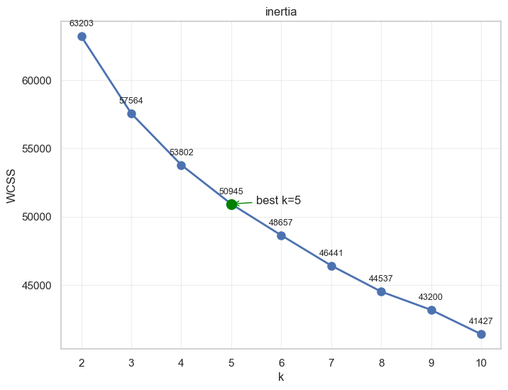
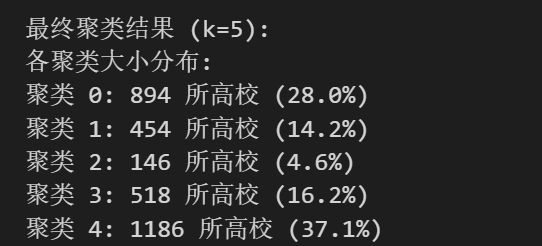
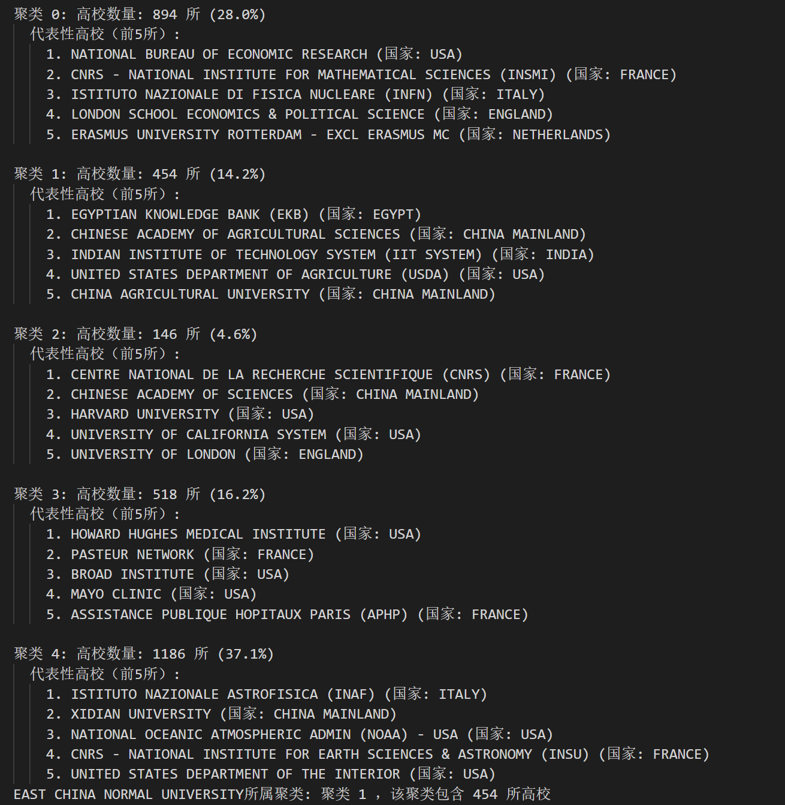
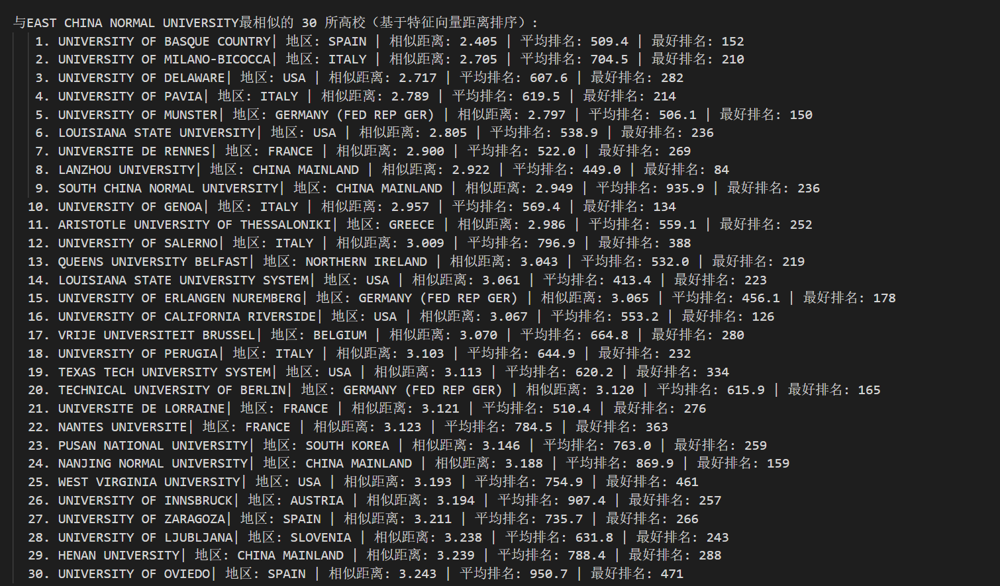
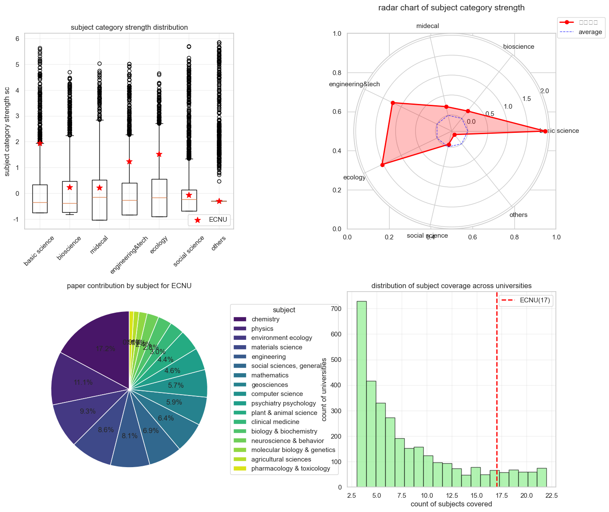

# lab5 机器学习相关数据分析

本次实验主要在之前的esi学科数据初步分析的基础上进一步进行**运用到机器学习方法的数据分析**，对应的代码在`analysisCode.ipynb`

## 0数据准备

在lab4通过sql语句得到的`unified_data`的基础上，在mysql workbench中把`unified_data`导出为`alldata.csv`，作为本次实验分析的**数据来源**。

- 查看**数据基本信息**

  原数据形状：（34121，9）

- 清除**数据缺失值**

  通过`df.isnull().sum()`来查找原数据是否有缺失值，结果显示除了在`country_region`上有3161个确实值以外别的字段都没有缺失值，为了便于后面的聚类及预测处理，我直接删去缺失值

  ```py
  df = df.dropna() # 删除缺失值
  ```

## 1 全球高校分类

使用**聚类**的方法来给全球高校进行分类。

### 1.1 特征选择与数据降维

为了从一个包含大学在不同学科排名和科研指标的数据集中，构建出一套高质量、结构化、可用于聚类的特征矩阵，需要首先进行**特征工程**处理。

整体的流程如下图所示：

```text
原始数据 df
    ↓
按大学分组 → 构建每个大学的“学科向量”
    ↓
构造四大特征矩阵：
  1. presence: 是否有该学科（存在性）
  2. perf: 排名转化的绩效得分
  3. impact: 引用表现
  4. scale: 发文规模
    ↓
转为 DataFrame（宽表形式）
    ↓
按学科类别聚合 → 计算“类别级平均强度” → 得到高层次结构特征
    ↓
对高维学科特征降维（SVD）→ 减少维度、保留主要模式
    ↓
合并所有特征 → 构造最终特征矩阵
    ↓
标准化 → 适配机器学习模型输入要求
    ↓
输出：X_cluster_scaled_df（标准化特征）+ university_basic_info（元信息）
```

具体的四个特征的构造与解释如下：

- Presence（存在性）：主要记录该大学是否有该学科（该大学的该学科**是否上榜**），若该学科有排名记录，则记为 1；否则为 0

  ```py
  pres = s['world_rank'].notna().astype(int).fillna(0).values
  ```

- Perf（绩效得分）：反应该大学在该学科的**排名情况**，不过由于原始 `world_rank` 是一个自然数，**不连续**，数值越大表示越差（**反向**）且**差距不均匀**（如第 1 和第 2 名差距巨大；第1000和1001几乎没区别），需要对原始排名进行处理。于是我使用一个 **S型（Sigmoid）函数** 来将排名转化为 [0,1] 区间的绩效得分：

  ```py
  perf = s['world_rank'].apply(lambda r: 1 / (1 + np.exp((r - 100) / 50)) if pd.notna(r) else 0.0).fillna(0).values
  ```

  强调前 100 名的价值，符合“头部集中”的现实

- Impact（影响力）：篇均被引，为了减小极端值的压倒性影响，使用**平方根**来对数据进行简单压缩。

  ```pytho
  imp = np.sqrt(s['cites_per_paper']).fillna(0).values
  ```

- Scale（规模）：发文量，处理方式通篇均引用量

  ```py
  sca = np.sqrt(s['web_of_science_documents']).fillna(0).values
  ```

数据降维中，使用`TruncatedSVD`对上述的`presence`（存在性）和`perf`（绩效得分）这两个特征来进行降维，`TruncatedSVD`类似于 PCA降维方法，但更适用于稀疏矩阵，通过找出数据中方差最大的几个方向（主成分）来进行降维，核心代码：

```py
svd_pres = TruncatedSVD(n_components=max_components, random_state=42)
svd_perf = TruncatedSVD(n_components=min(max_components,perf_df.shape[1]),random_state=42)
```

### 1.2 确定最优聚类数量（确定k值）

采用**肘部法则**来确定聚类的最佳k值，肘部法则是通过计算**簇内误差平方和**，观察折线图，寻找下降幅度开始变小的“拐点”来确认最佳k值的。

根据本题数据所画出来的肘部法则折线图如下：



可以得到，**最佳的聚类k值为5**。

### 1.3 聚类结果与分析

然后依据`k=5`来对全球高校的数据进行Kmeans聚类，将全球高校分为五类：

```py
optimal_k = 5
kmeans_final = KMeans(n_clusters=optimal_k, random_state=42, n_init=10)
```

聚类结果如下：



其中**华东师范大学**在**聚类 1**（含454所高校）

各聚类的基本情况及代表性国家如下所示：

### 1.4 与华东师大相似的高校

通过计算与华师大**同一聚类（聚类1）**中的高校与华东师大特征向量的**欧氏距离**来找到与华师大相似的高校，最后的结果显示前30相似的高校：



其中中国大陆的学校有：兰州大学、南京师范大学等；海外的大学有美国的特拉华大学（qs=506）、西班牙的巴斯克大学（qs=625）等（25年华师大的qs排名为501）。可见该由数据出发的，通过特征向量与聚类找到的相似高校的方法很靠谱:thumbsup:

## 2 ECNU学科画像 

从**学科实力**，**科研产出**，**学科分布**等角度，结合**数据分析与可视化**对华东师范大学进行学科画像。将22个学科按照习惯分为几个大类，分别为基础科学(`basic_science`)、生命科学(`bioscience`)、医药学(`midecal`)、工科(`engineering&tech`)、生态学(`ecology`)、社会科学(`social science`)、其他(`others`)。具体包含学科如下：

```py
subject_categories = {
    'basic science': ['chemistry', 'physics', 'mathematics', 'geosciences'],
    'bioscience': ['biology & biochemistry', 'plant & animal science', 'molecular biology & genetics','microbiology', 'neuroscience & behavior', 'immunology'],
    'midecal': ['clinical medicine', 'pharmacology & toxicology', 'psychiatry psychology'],
    'engineering&tech': ['engineering', 'materials science', 'computer science'],
    'ecology': ['agricultural sciences', 'environment ecology'],
    'social science': ['social sciences, general', 'economics & business'],
    'others': ['multidisciplinary', 'space science']
}
```

- 学科实力角度，利用**箱型图**（下图左上）绘制了华师大各个学科大类在全球上榜高校的水平，利用**雷达图**（下图右上）展现了华师大在各个学科的综合实力，可以看出华师大强势/弱势的学科类别。结果显示，华师大在化学、物理、数学、地理等**基础学科**的学术水平最为突出，**环境**与计算机等**工科**学科的学术实力也较高，**医药、社会科学**等学科类别的学术水平较弱。
- 科研产出角度，基于各个学科的论文产出，通过绘制**饼图**（下图左下）表现华师大各个学科的科研产出情况。结果显示，化学（17.2%）、物理（11.1%）和环境生态（9.3%）贡献的论文数为数据所涉及学科的前三名
- 学科广度角度，统计全球各个高校的上榜学科数量，利用**柱形图**（下图右下）展现华师大的学科综合发展能力。结果显示，华师大上榜学科数量为17，在全部上榜高校中处于前列，可见华师大是个学科综合发展的高校:thumbsup:



## 3 排名预测模型

通过**发表论文总数、总被引次数、篇均被引、高影响力论文数**等来作为预测排名的核心指标，尝试使用**线性回归**和**随机森林**模型，将数据先用学科进行分组，再进行训练（训练集60%，训练集20%，测试集20%），并利用R方和MSE来评估模型的预测情况。

结果显示，利用线性回归进行的预测准确度较低，随机森林模型的预测准确度较高。

| 学科名称                     | 样本量 | 线性回归 R² | 随机森林 R² | 推荐模型      |
| ---------------------------- | ------ | ----------- | ----------- | ------------- |
| agricultural sciences        | 1331   | 0.386       | 1.000       | Random Forest |
| biology & biochemistry       | 1601   | 0.472       | 1.000       | Random Forest |
| chemistry                    | 2094   | 0.282       | 1.000       | Random Forest |
| clinical medicine            | 4459   | 0.233       | 1.000       | Random Forest |
| computer science             | 839    | -9.651      | 0.9999      | Random Forest |
| economics & business         | 537    | 0.079       | 0.9999      | Random Forest |
| engineering                  | 2673   | 0.341       | 1.000       | Random Forest |
| environment ecology          | 1988   | 0.373       | 1.000       | Random Forest |
| geosciences                  | 1142   | 0.303       | 1.000       | Random Forest |
| immunology                   | 1145   | 0.426       | 1.000       | Random Forest |
| materials science            | 1550   | 0.523       | 1.000       | Random Forest |
| mathematics                  | 385    | -0.538      | 1.000       | Random Forest |
| microbiology                 | 785    | 0.479       | 1.000       | Random Forest |
| molecular biology & genetics | 1142   | 0.384       | 1.000       | Random Forest |
| multidisciplinary            | 214    | 0.453       | 0.999       | Random Forest |
| neuroscience & behavior      | 1240   | 0.418       | 1.000       | Random Forest |
| pharmacology & toxicology    | 1353   | 0.563       | 1.000       | Random Forest |
| physics                      | 973    | 0.595       | 1.000       | Random Forest |
| plant & animal science       | 1869   | 0.404       | 1.000       | Random Forest |
| psychiatry psychology        | 1108   | 0.434       | 1.000       | Random Forest |
| social sciences, general     | 2300   | 0.334       | 1.000       | Random Forest |
| space science                | 232    | 0.668       | 0.999       | Random Forest |

于是采用**随机森林**作为最终的有效预测模型，同时得到，随机森林所采取的**最关键预测特征为`cites`（即论文被引用量**），即模型主要通过某大学在某学科发表的论文被引用量来预测排名情况。


