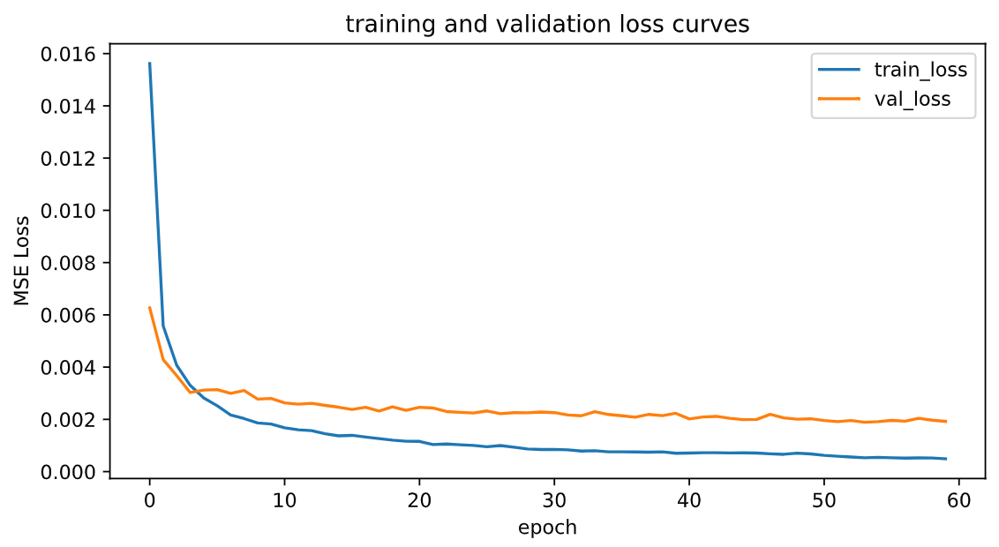
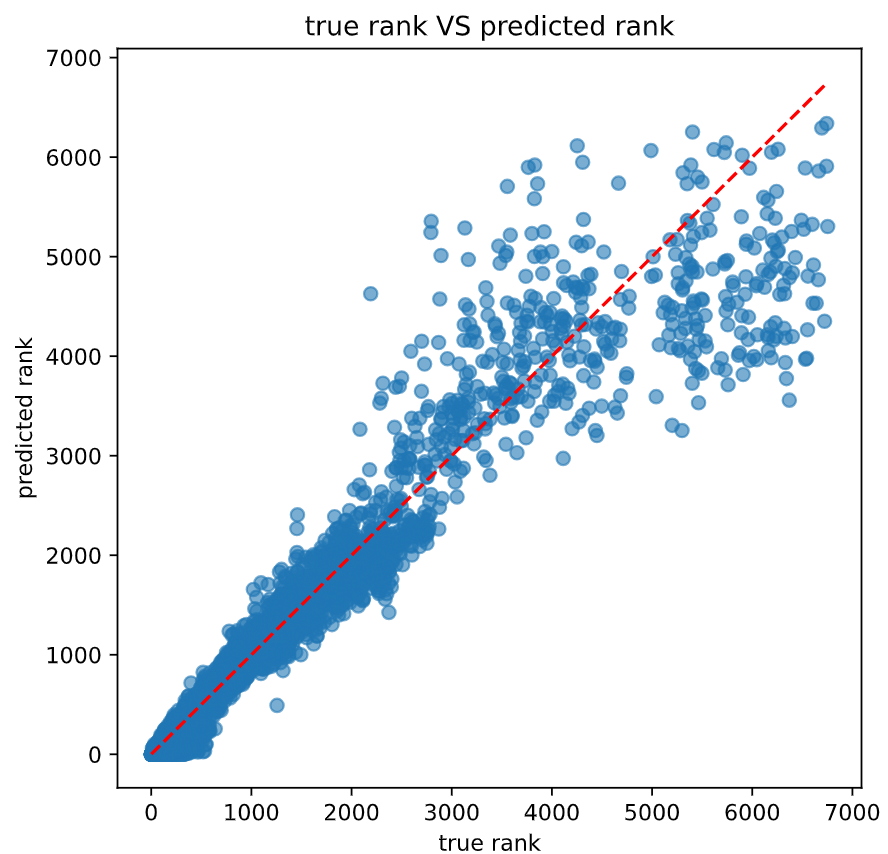
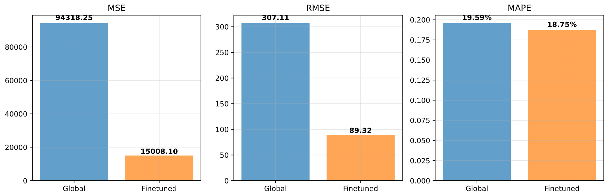
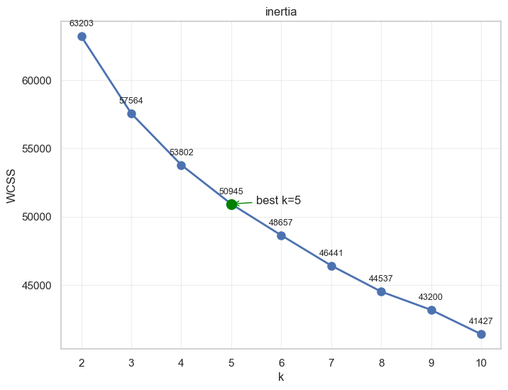
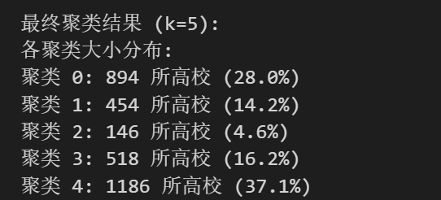
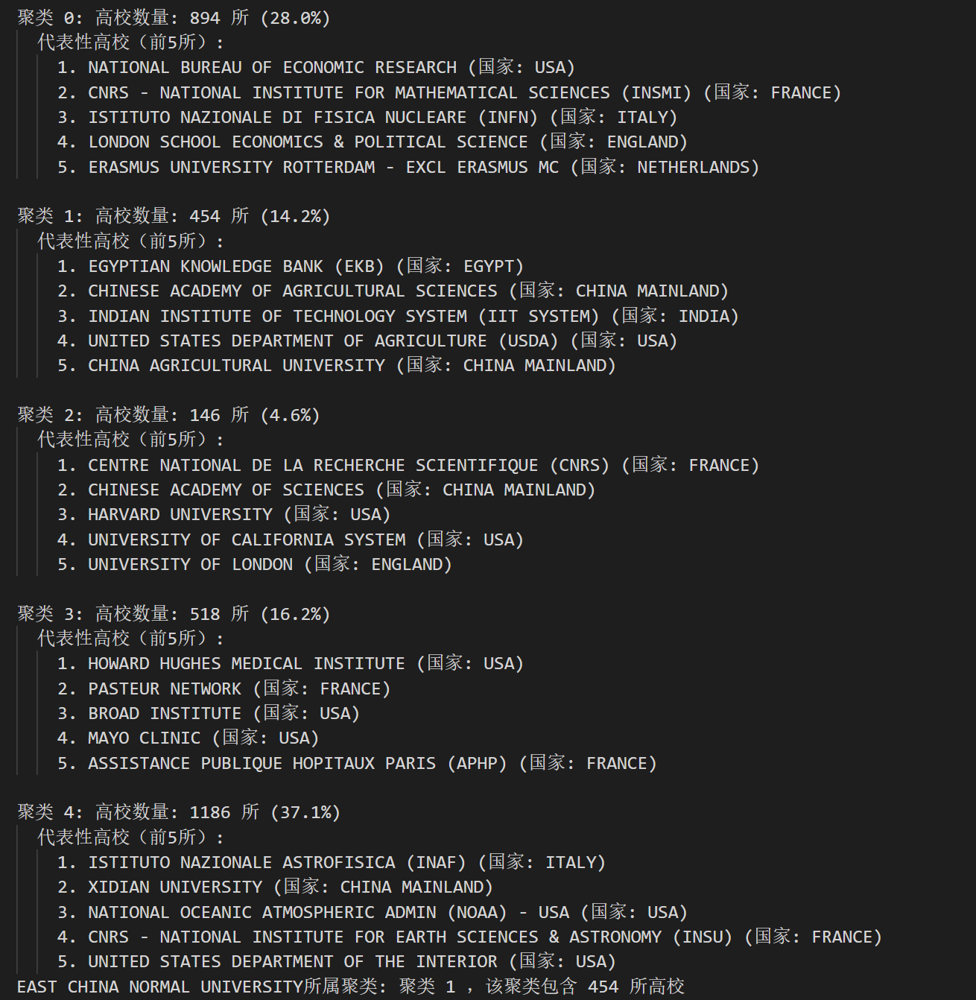
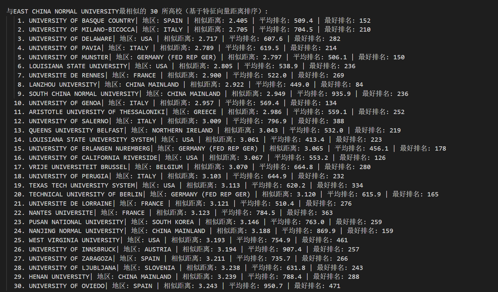
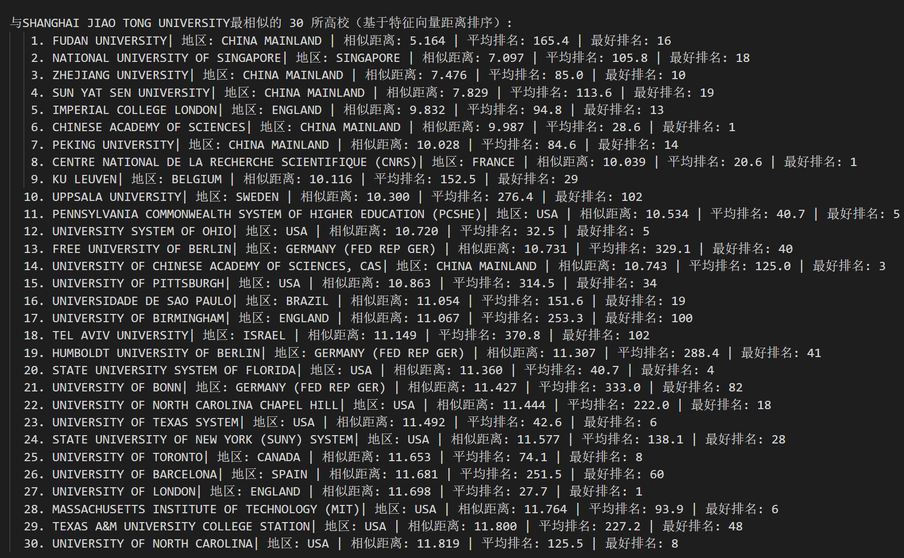

# lab6 深度学习&聚类分析

本次实验主要在之前的esi学科数据分析的基础上进一步进行运用到**深度学习方法**的数据分析，对应的代码在`DeepAnalysis.ipynb`，**聚类**的代码在`kmeans.ipynb`，本次实验包括：

- 利用**深度学习**方法，对各学科做一个**排名模型**，能够较好的预测出排名位置，并且利用MSE，MAPE等指标来进行评价模型的优劣。
- 对ESI的数据进行**聚类**，发现与华师大**类似的学校**有哪些并进行分析

## 0 实验数据准备

在lab4通过sql语句得到的`unified_data`的基础上，在mysql workbench中把`unified_data`导出为`alldata.csv`，作为本次实验分析的**数据来源**。

- 查看**数据基本信息**

  原数据形状：（34121，9）

- 清除**数据缺失值**

  通过`df.isnull().sum()`来查找原数据是否有缺失值，结果显示除了在`country_region`上有3161个确实值以外别的字段都没有缺失值，为了便于后面的聚类及预测处理，我直接删去缺失值

  ```py
  df = df.dropna() # 删除缺失值
  ```

## 1 深度学习预测排名

使用包含**数值特征**和**类别特征**（通过embedding向量化）的**MLP（多层感知器）模型**来进行排名预测，大致流程总结为：

1. 数据**准备**
2. 数据集及模型的**定义**
3. **训练**模型
4. **评估**结果
5. **保存**网络

我尝试了**三种建模思路**：

- 直接利用**全部学科的数据**训练一个**全局模型**

  （优点是这样训练的数据量比较大，但是不同学科的数据可能会互相干扰）

- **分学科单独训练**，每个学科拥有一个该学科排名预测模型

  （优点是不会有学科间的干扰，但是单个学科数据量太少可能模型训练不好）

- 首先利用全部学科的数据训练一个**全局模型**，然后再利用分学科的数据对模型进行**微调**

  （综合以上两种的利弊，效果相对较好！）

最终代码和本报告采用**第三种**建模思路

### 1.1 深度学习数据准备

数据准备阶段进行了：

- 设置**随机种子**以便复现

- 选择训练所使用的**设备**（gpu/cpu，不过我只有cpu可以用）

- 选择**目标变量**（即`world_rank`排名）

- 选择**数值和类别特征**（其中类别特征需要进行**编码**）

  ```py
  # 数值特征
  num_features = ["web_of_science_documents", "cites", "cites_per_paper", "top_papers"]
  # 类别特征
  cat_features = ["subject_name", "institution_name", "country_region"]
  ```

- **划分数据集**

  ```py
  # 划分数据集：最初按60% 训练 / 20% 验证 / 20% 测试的比例来进行划分
  Xn_train, Xn_temp, Xc_train, Xc_temp, y_train, y_temp = train_test_split( X_num_scaled, X_cat, y_scaled, test_size=0.4, random_state=seed )
  Xn_val, Xn_test, Xc_val, Xc_test, y_val, y_test = train_test_split( Xn_temp, Xc_temp, y_temp, test_size=0.5, random_state=seed )
  ```

  `train_test_split()`默认将数据进行**打乱后再划分**

- 数值特征**标准化**&目标特征**缩放**

  不同的特征量纲相差较大，标准化后的数值特征可以使训练更稳定，防止梯度爆炸。注意只在训练集上`fit()`，在验证集和测试集上`transform()`，而**不是所有数据一起`fit()`**，**防止数据泄露**！

  ```py
  scaler = StandardScaler()
  Xn_train_scaled = scaler_X.fit_transform(Xn_train) # 只有训练集用于拟合标准化器
  Xn_val_scaled = scaler_X.transform(Xn_val)
  Xn_test_scaled = scaler_X.transform(Xn_test) # 不重新fit 直接使用
  ```

​	使用MinMax把目标排名缩放到 [0,1]也是如此，**只有训练集用于拟合缩放器**

```py
y_scaler = MinMaxScaler()
y_train_scaled = y_scaler.fit_transform(y_train.reshape(-1, 1)) # 只有训练集用于拟合缩放器
y_val_scaled = y_scaler.transform(y_val.reshape(-1, 1))
y_test_scaled = y_scaler.transform(y_test.reshape(-1, 1))
```

### 1.2 数据集及模型的定义

- 定义数据集

继承实用工具（utils）中的`DataSet`的类对训练/验证/测试数据集进行分装，重写\_\_init\_\_、\_\_getitem\_\_、\_\_len\_\_三个方法，分别是为了**加载数据集、获取数据索引和获取数据总量**。

```py
# 自定义 Dataset
class ESIDataset(Dataset):
    def __init__(self, X_num, X_cat, y):
        self.X_num = torch.tensor(X_num, dtype=torch.float32) # 输入数值特征
        self.X_cat = torch.tensor(X_cat, dtype=torch.long) # 输入类别特征
        self.y = torch.tensor(y, dtype=torch.float32) # 输出目标
            
	def __getitem__(self, idx):
        return self.X_num[idx], self.X_cat[idx], self.y[idx]
   
    def __len__(self):
        return len(self.y)
```

设定**批次加载器**，**分小批次梯度下降**，使训练更精细，训练集的`shuffle=True` 表示先洗牌再分批

```py
train_loader = DataLoader(train_dataset, batch_size=64, shuffle=True) 
```

- 定义网络模型

定义网络模型`RankPredictor`，该类继承自`nn.Module`，可以访问基类`nn.Module`中所有的非私有成员，但是一定需要重写\_\_init\_\_和forward函数。

在\_\_init\_\_**构造函数**中，利用embedding将离散数据映射为连续变量，捕捉潜在关系。embedding维度越大表示能捕捉越丰富的信息，但同时参数也越多、易过拟合，所以用`emb_dim = min(50, max(4, cat_dim // 2))`来确定**合适的嵌入维度**，防止过大或过小；利用`nn.Sequential`容器来实现**简单的顺序连接**模型，本模型包含三层（不算输入层，中间两层+输出层），每层构造：`nn.Linear`**全连接层（线性层）**只能拟合线性关系，还需要一个**激活函数**来引入非线性关系（常用的激活函数有`nn.ReLU()`，`nn.Sigmoid()`等），`nn.Dropout`**丢弃层**随机"关闭"一部分神经元，防止过拟合，提升模型的泛化能力。

```py
class RankPredictor(nn.Module):
    def __init__(self, num_input_dim, cat_dims, hidden_dim=128, dropout=0.2):
        super().__init__()
        # 嵌入层
        self.emb_layers = nn.ModuleList() # 创建模块列表用于存储嵌入层
        for cat_dim in cat_dims:
            emb_dim = min(50, max(4, cat_dim // 2))
            self.emb_layers.append(nn.Embedding(cat_dim, emb_dim))
        emb_total = sum([emb.embedding_dim for emb in self.emb_layers]) # 嵌入层总维度
        input_dim = num_input_dim + emb_total # 总输入维度

        # 网络结构
        self.net = nn.Sequential(
            nn.Linear(input_dim, hidden_dim), # 第一层
            nn.ReLU(),
            nn.Dropout(dropout),

            nn.Linear(hidden_dim, hidden_dim // 2), # 第二层
            nn.ReLU(),
            nn.Dropout(dropout),

            nn.Linear(hidden_dim // 2, 1), # 输出层
            nn.Sigmoid()
        )

    def forward(self, x_num, x_cat):
        emb = [emb_layer(x_cat[:, i]) for i, emb_layer in enumerate(self.emb_layers)]
        x = torch.cat([x_num] + emb, dim=1)
        return self.net(x)
```

在forward**前向传输**函数中，将嵌入层和数值特征拼接在一起，并传输进网络，实现各个层之间的连接关系。

### 1.3 训练模型

训练部分需要设定几个重要的**函数和参数**：

- **损失函数**（criterion）：衡量模型预测好坏模型内部调参标准，有多种损失函数可以选择，如：

  ```py
  criterion = nn.MSELoss()
  ```

- **优化方法**（optimizer）：模型进一步改进的学习方法，也有多种优化方法可以选择，如：

  ```pyt
  optimizer = torch.optim.Adam(model.parameters(), lr=1e-3)
  ```

- **学习率**（learning rate）：每次改进的幅度，学习率越大训练的越快，但容易错过最低点；学习率越小训练越久，但更精细

  ```py
  # 学习率调度器：根据结果更新学习率
  cheduler = torch.optim.lr_scheduler.ReduceLROnPlateau(optimizer, mode='min', factor=0.5, patience=4, verbose=True)
  ```

- **轮次数**（epoch）与**早停**（patience）：每一轮训练全部样本进行1次前向传播与反向传播，如果几轮训练结果都没有什么改进，将会触发早停，提前结束训练

具体的训练代码如下：

```py
for epoch in range(1, n_epochs_pretrain + 1):
    model.train() # 训练模式
    running_loss = 0.0
    for Xn_batch, Xc_batch, yb in train_loader:
        # 数据搬到设备
        Xn_batch = Xn_batch.to(device)
        Xc_batch = Xc_batch.to(device)
        yb = yb.to(device)
        # 前向传播
        pred = model(Xn_batch, Xc_batch)
        loss = criterion(pred, yb)
        # 反向传播与优化
        optimizer.zero_grad()
        loss.backward()
        optimizer.step()
        # 累积损失
        running_loss += loss.item() * Xn_batch.size(0)
    
    # ----然后通过验证集上的结果调整参数和优化模型---
```

### 1.4 评估模型

在测试集上对模型进行测试，并计算MSE、RMSE、MAPE等评估指标。

- 训练过程中记录的训练集的loss曲线如下，可见loss随着训练轮次的增加下降，起初下降得很快，后来下降得很慢：

  

- 测试集测试：

  由于测试时，只需让测试集进行1次前向传播即可，这个过程不需要计算梯度， 因此可以使用`with torch.no_grad()`在该局部关闭梯度。

  ```py
  model.eval() # 开启测试模式
  preds = []
  trues = []
  with torch.no_grad():
      for Xn_batch, Xc_batch, yb in test_loader: # 批量循环处理
          # 数据移动
          Xn_batch = Xn_batch.to(device)
          Xc_batch = Xc_batch.to(device)
          out = model(Xn_batch, Xc_batch).cpu().numpy() # 1次前向传播
          # 结果收集
          preds.append(out) # 预测结果
          trues.append(yb.cpu().numpy()) # 真实结果
  ```

- 量化的评估指标

  评估模型主要使用以下3个量化指标：

  | 指标     | 计算方式       | 单位       | 特点         |
  | :------- | :------------- | :--------- | :----------- |
  | **MSE**  | 误差平方的平均 | 平方单位   | 惩罚大误差   |
  | **RMSE** | MSE的平方根    | 原数据单位 | 实际解释性好 |
  | **MAPE** | 相对误差百分比 | 百分比%    | 无量纲易理解 |

​	计算代码:

```py
mse_global = mean_squared_error(trues_orig, preds_orig)
rmse_global = np.sqrt(mse_global)
mape_global = mean_absolute_percentage_error(trues_orig, preds_orig)
```

- 可视化模型预测效果

  真实排名和预测排名的散点图如下，落在红色对角线上代表预测准确，可以看出，由于数据中排名靠前的数据较多，**排名靠前的数据预测较好**；**大于4000后模型预测效果相对不佳**。

  

### 1.5 分学科微调模型

如前面所说，为了增加模型的准确性，利用全部学科的数据训练一个**全局模型**后，再利用分学科的数据对模型进行**微调**，充分利用数据量的同时尽可能不受不同学科的干扰。

将数据按照学科进行分组后，设置**微调的训练参数**：

```py
finetune_epochs = 25  # 微调 epoch 数（少量）
finetune_lr = 1e-5  # 微调学习率（较小）
finetune_patience = 5  
```

其中的epoch数和学习率都较小，目的是**避免干扰以前已学习的特征**，保持原有学习特征的前提下进行**更精细的优化**。

微调训练的流程和全局模型的训练类似（准备数据-->训练-->计算损失-->l利用验证集调整-->优化模型），不同的是开始时将模型state初始化为微调前的最佳，微调模型时以其为参照。

```py
 best_sub_state = best_state.copy()  # 初始化为微调前的最佳
```

将**全局模型和微调模型的MSE，RMSE，MAPE三个指标进行对比**，绘制的柱形图如下：


结果显示，微调后模型的**MSE和RMSE都显著下降**，从全局模型结果的平均相差307名优化到到平均**相差百名以内**，微调效果明显！

最后，将训练好的网络模型**保存**，方便日后复现：

```py
torch.save(best_state, 'rank_predict_model.pth')
```

终于**成功利用深度学习方法完成了一个排名预测模型**！

> - 虽然感觉折腾一番效果居然远差于上次的随机森林...
> - 可能由于数据量还是不够大（尤其是排名较靠后的数据），还有就是没有进行细致的调参，模型持续优化（调参）方向：
>   - 调整数据集测试集的划分
>   - 尝试其他的损失函数/优化方法
>   - 改变训练轮数/patience/学习率
>   - ......

## 2 全球高校聚类

使用**聚类**的方法，基于ESI学科学术数据，来给全球高校进行分类并找出与华师大类似的学校。

### 2.1 特征选择与数据降维

为了从一个包含大学在不同学科排名和科研指标的数据集中，构建出一套高质量、结构化、可用于聚类的特征矩阵，需要首先进行**特征工程**处理。

整体的流程如下图所示：

```text
原始数据 df
    ↓
按大学分组 → 构建每个大学的“学科向量”
    ↓
构造四大特征矩阵：
  1. presence: 是否有该学科（存在性）
  2. perf: 排名转化的绩效得分
  3. impact: 引用表现
  4. scale: 发文规模
    ↓
转为 DataFrame（宽表形式）
    ↓
按学科类别聚合 → 计算“类别级平均强度” → 得到高层次结构特征
    ↓
对高维学科特征降维（SVD）→ 减少维度、保留主要模式
    ↓
合并所有特征 → 构造最终特征矩阵
    ↓
标准化 → 适配机器学习模型输入要求
    ↓
输出：X_cluster_scaled_df（标准化特征）+ university_basic_info（元信息）
```

具体的四个特征的构造与解释如下：

- Presence（存在性）：主要记录该大学是否有该学科（该大学的该学科**是否上榜**），若该学科有排名记录，则记为 1；否则为 0

  ```py
  pres = s['world_rank'].notna().astype(int).fillna(0).values
  ```

- Perf（绩效得分）：反应该大学在该学科的**排名情况**，不过由于原始 `world_rank` 是一个自然数，**不连续**，数值越大表示越差（**反向**）且**差距不均匀**（如第 1 和第 2 名差距巨大；第1000和1001几乎没区别），需要对原始排名进行处理。于是我使用一个 **S型（Sigmoid）函数** 来将排名转化为 [0,1] 区间的绩效得分：

  ```py
  perf = s['world_rank'].apply(lambda r: 1 / (1 + np.exp((r - 100) / 50)) if pd.notna(r) else 0.0).fillna(0).values
  ```

  强调前 100 名的价值，符合“头部集中”的现实

- Impact（影响力）：篇均被引，为了减小极端值的压倒性影响，使用**平方根**来对数据进行简单压缩。

  ```pytho
  imp = np.sqrt(s['cites_per_paper']).fillna(0).values
  ```

- Scale（规模）：发文量，处理方式通篇均引用量

  ```py
  sca = np.sqrt(s['web_of_science_documents']).fillna(0).values
  ```

数据降维中，使用`TruncatedSVD`对上述的`presence`（存在性）和`perf`（绩效得分）这两个特征来进行降维，`TruncatedSVD`类似于 PCA降维方法，但更适用于稀疏矩阵，通过找出数据中方差最大的几个方向（主成分）来进行降维，核心代码：

```py
svd_pres = TruncatedSVD(n_components=max_components, random_state=42)
svd_perf = TruncatedSVD(n_components=min(max_components,perf_df.shape[1]),random_state=42)
```

### 2.2 确定最优聚类数量（确定k值）

采用**肘部法则**来确定聚类的最佳k值，肘部法则是通过计算**簇内误差平方和**，观察折线图，寻找下降幅度开始变小的“拐点”来确认最佳k值的。

根据本题数据所画出来的肘部法则折线图如下：



可以得到，**最佳的聚类k值为5**。

### 2.3 聚类结果与分析

然后依据`k=5`来对全球高校的数据进行Kmeans聚类，将全球高校分为五类：

```py
optimal_k = 5
kmeans_final = KMeans(n_clusters=optimal_k, random_state=42, n_init=10)
```

聚类结果如下：



其中**华东师范大学**在**聚类 1**（含454所高校）

各聚类的基本情况及代表性国家如下所示：

### 2.4 与华东师大相似的高校

通过计算与华师大**同一聚类（聚类1）**中的高校与华东师大特征向量的**欧氏距离**来找到与华师大相似的高校，最后的结果显示前30相似的高校：



结果显示的相似高校中，中国大陆的学校有：**兰州大学**（同为末流985）、**南京师范大学**（同为江浙沪师范学校）等；海外的大学有**美国的特拉华大学**（qs=506）、**西班牙的巴斯克大学**（qs=625）等（25年华师大的qs排名为501）。可见该由数据出发的，通过特征向量与聚类找到的相似高校的方法很靠谱！

> **除此以外**，出于好奇与检验的目的，我还尝试**将target学校从华师大改为交大**，看看此聚类模型能找到哪些与交大类似的学校：

```python
target = 'SHANGHAI JIAO TONG UNIVERSITY'
```

显示的前30相似高校结果如下：


可以看到，根据此ESI数据，与上海交通大学相似排名第一的使复旦大学，第二的是新加坡国立大学，第三的是浙江大学（top3），和常识较为符合，更加应证了这个简单的“特征工程+Kmeans聚类+欧氏距离”找相似高校的模型效果不错！
